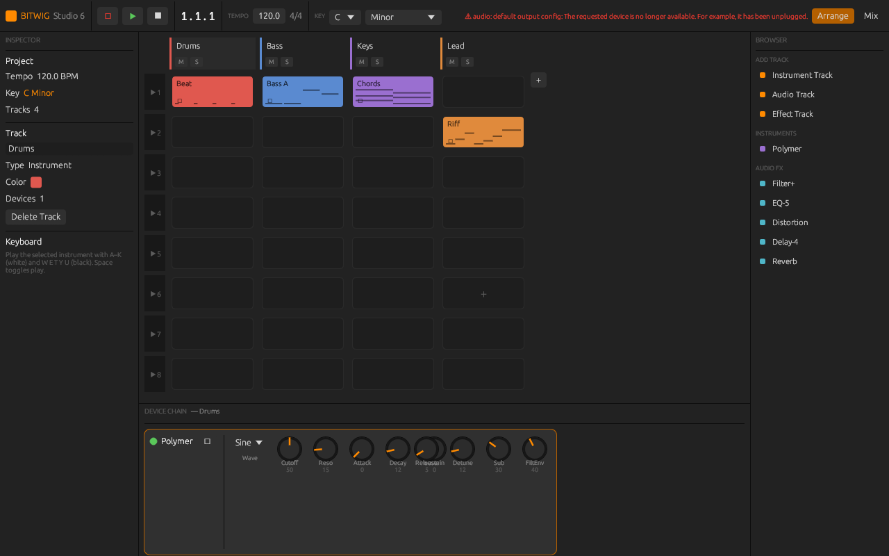

# Bitwig Studio 6 — Clone

A **native desktop DAW** written in Rust, modelled on
[Bitwig Studio 6](https://www.bitwig.com). It has a real-time audio engine
(lock-free, no allocation on the audio thread) driving hardware output through
**cpal**, and an immediate-mode GUI built with **egui/eframe** that mirrors
Bitwig 6's refreshed dark interface and hybrid Clip-Launcher workflow.

> Code-level identity with a commercial, closed-source C++ application is not
> attainable. This is a faithful, *running* reimplementation of Bitwig 6's
> architecture, signature workflow and visual language — a genuine DAW, not a
> mock-up.



## Build & run

Requires a Rust toolchain and ALSA dev headers on Linux
(`libasound2-dev`); macOS/Windows need no extra packages.

```bash
cargo run -p dawapp --release
```

The window opens into the Clip Launcher with a small demo project. Press
**Space** to start playback, click a clip to launch it, double-click a clip to
open the piano roll, and play the selected instrument live with the **A–K**
(white) / **W E T Y U** (black) keys.

Run the engine's offline tests (no audio hardware needed — they render to a WAV
and assert real signal):

```bash
cargo test -p dawcore
```

## Architecture

A Cargo workspace with a hard split between the real-time core and the front-end.

```
crates/
  dawcore/   ── real-time audio engine + DSP. No GUI, no hardware deps.
    dsp/       band-limited oscillators (polyBLEP), ADSR, TPT state-variable
               filter, polyphonic voice/synth, stereo delay, FDN reverb, EQ, drive
    model.rs   plain-data project model (tracks, clips, devices, scenes, key sig)
    command.rs lock-free UI→audio message protocol (+ garbage return channel)
    engine.rs  audio-thread engine: sample-accurate scheduler, mixer, modulators
    sync.rs    helpers to mirror model edits into the engine
    tests/     offline render tests (engine → WAV, assert non-silence/finite/limited)

  dawapp/    ── native front-end.
    audio.rs   cpal output stream; the Engine is moved into the audio callback
    theme.rs   Bitwig 6 dark visual language for egui
    widgets.rs custom-painted rotary knobs, faders, signal meters
    app.rs     the DAW UI: transport, inspector, browser, clip launcher,
               mixer, device panel, piano roll
    main.rs    eframe entry point
```

### Real-time discipline

The audio callback never allocates, locks, or makes syscalls:

- **UI → audio** messages travel over a lock-free SPSC ring buffer
  (`ringbuf`). Hot messages (notes, transport, parameter tweaks) carry only
  small `Copy` payloads.
- **Structural edits** (adding a track, replacing a clip's notes) build their
  heap objects *on the UI thread* and hand them over as `Box<…>`. When the audio
  thread swaps one in, the displaced object is shipped **back** through a garbage
  channel so it is dropped by the UI thread, never freed under the audio lock.
- **Readback** (transport position, per-track meters, active scene, voice count)
  is published through atomics the UI polls each frame.

### Audio engine

- Sample-accurate look-ahead scheduler converts clip notes (looped, phase-locked
  to the global transport) into precisely-timed voice triggers.
- Per-track device chain: a polyphonic **Polymer** synth (two band-limited
  detuned oscillators + sub → TPT SVF with its own envelope → ADSR amp, 16-voice
  pool with oldest-voice stealing) followed by insert effects.
- **Effects:** Filter+ (multi-mode SVF), EQ-5 (3-band), Distortion (tanh
  shaper), Delay-4 (ping-pong with damped feedback), Reverb (4-line feedback
  delay network with a Householder mixing matrix).
- **Modulators:** per-device LFOs routable to any parameter with bipolar depth —
  Bitwig's signature modulation concept — applied at block rate before DSP.
- Equal-power panning, mute/solo, and a `tanh` master limiter.

## Implemented vs. Bitwig 6

| Area | Status |
| --- | --- |
| Hybrid Clip Launcher + scenes | ✅ launch clips/scenes, phase-locked playback |
| Refreshed dark v6 UI, rounded corners | ✅ |
| Project key signature (new in v6) | ✅ root + scale, drives piano-roll scale highlighting |
| Tracks: instrument / audio / effect | ✅ |
| Per-track device chains, bypass | ✅ |
| Built-in synth + 5 insert effects | ✅ all DSP written from scratch |
| Per-device LFO modulators | ✅ |
| Mixer: faders, pan, meters, solo/mute, master | ✅ |
| Piano roll: add/move/resize/delete, snap, scale highlight, playhead | ✅ |
| Transport: tempo, time-sig, position, computer-keyboard MIDI | ✅ |

### Known scope boundaries

Audio recording/sampler, VST/CLAP plugin hosting, The Grid, the arranger
timeline, automation lanes, comping and clip aliases are **not** implemented.
Effects are lightweight original DSP, not Bitwig's. These are deliberate
boundaries, not bugs.

## Testing hooks

Two environment variables help when launching for inspection:
`BITWIG_VIEW=mix` opens straight into the mixer; `BITWIG_EDIT=1` opens a clip in
the piano roll on start.
