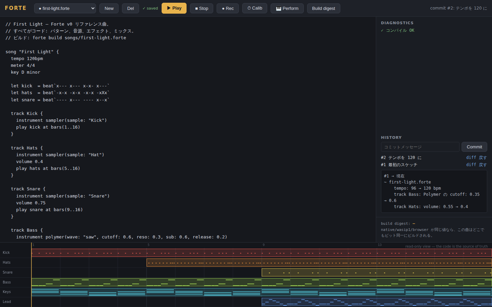
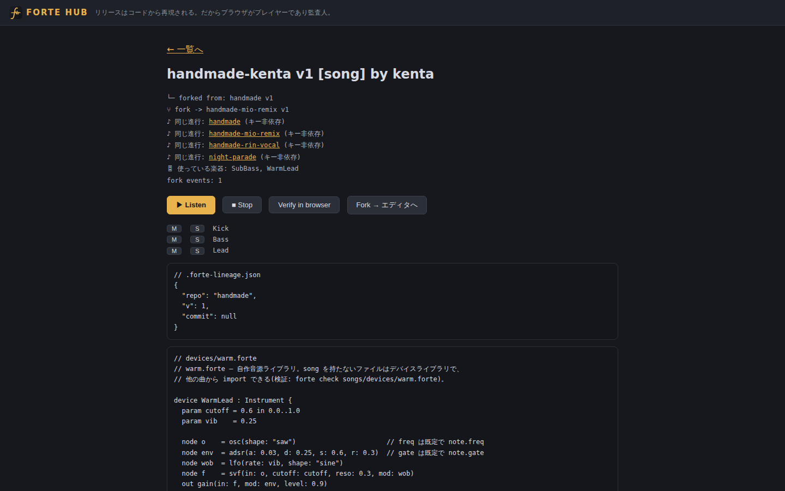
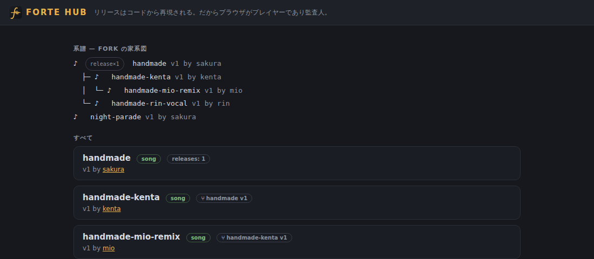

<p align="center">
  
</p>

<h1 align="center">Forte</h1>
<p align="center"><b>compose music as code</b></p>
<p align="center">曲も、音源も、エフェクトも、演奏も — ぜんぶ読める・直せる・fork できるソースコード。</p>

---

**音楽制作を「コード・fork・ビルド・リリース」によるオープン開発の世界へ。**
曲も、パターンも、コード進行も、そして音源そのものも、読める・直せる・fork できる
ソースコード(`.forte`)。ビルドは決定論的で、同じコミットからは native / wasm /
ブラウザのどこでも**ビット同一のオーディオ**が再現される。リリースの正しさは
誰でも(ブラウザのタブからでも)再検証できる。

**📖 使い方ガイド(チュートリアル): [docs/GUIDE.md](docs/GUIDE.md)** /
言語リファレンス: [docs/webdaw/spec/forte-lang-v1.md](docs/webdaw/spec/forte-lang-v1.md) /
ビジョン・要求仕様・アーキテクチャ: [docs/webdaw/](docs/webdaw/README.md)
(IEC 62304 型のドキュメント体系)。

```forte
import { WarmLead, SubBass } from "./devices/warm.forte"

song "Handmade" {
  tempo 100bpm
  key G minor
  let line = prog`Gm | Eb | Bb | F`

  track Lead {
    instrument WarmLead(cutoff: 0.7, vib: 0.35)
    insert delay(time: 0.3, fdbk: 0.3, mix: 0.25)
    play arp(line, rate: 0.5, style: "updown") at bars(5..12)
  }
}
```

| ブラウザエディタ(History パネルで音楽語彙 diff) | Hub の系譜ページ |
| --- | --- |
|  |  |

**fork の家系図** — 誰の曲から誰のリミックスが生まれたかを一望(クリックで曲ページへ):



## Quickstart

```bash
# Linux は音を出すのに libasound2-dev が必要: sudo apt install libasound2-dev
cargo install --path crates/fortelang   # `forte` コマンドが入る(~/.cargo/bin)

forte repl                              # ★打った行がその場で鳴る
forte check songs/first-light.forte     # 検証(エラーは音楽の語彙+行番号)
forte play  songs/first-light.forte     # ライブ再生。保存するたび即反映
forte build songs/first-light.forte     # WAV + ビルド証明(digest 入り)
forte build songs/handmade-kit.forte --stems  # トラック別 WAV+ステム別 digest
forte export songs/first-light.forte    # 自己完結 zip(曲+テイク+証明+履歴)
```

REPL はこんな感じ:

```
forte> beat`x--- x-x-`                     ← 即ループ再生
♪ playing (120 bpm, loop 32 beats)
forte> let theme = prog`Am | F | C | G`
forte> arp(theme, rate: 0.25, style: "updown")
♪ playing
forte> :inst polymer(wave: "saw")          ← 音色を差し替え(鳴りっぱなし)
forte> :fx reverb(mix: 0.3)
forte> :save jam.forte                     ← ジャムがそのまま曲ファイルになる
```

| REPL コマンド | 効果 |
| --- | --- |
| (パターンを入力) | **現在のトラック**で即ループ再生。`beat` / `notes` / `prog` / `chords()` / `arp()` / `bass()` |
| `:track Bass` / `:tracks` / `:drop Bass` | トラックを重ねる(ループステーション)。以後のパターン・`:inst`・`:fx` はそのトラックへ |
| `:vol 0.7` / `:pan -0.3` / `:undo` | 現在トラックの音量/パン、一手戻る |
| `let 名前 = …` / `device … { … }` / `import …` | セッションに積む(複数行 OK、エラーはロールバック) |
| `:tempo 140` / `:inst polymer(…)` / `:fx reverb(…)` / `:fx clear` | 鳴らしたまま変更 |
| `:show` / `:save jam.forte` / `:stop` / `:quit` / `:help` | ソース表示 / 曲として保存 / 停止 / 終了 |

**ブラウザエディタ**(タイプ中診断・AudioWorklet 再生・OPFS 自動保存・完全オフライン PWA):

```bash
scripts/build_web.sh
python3 -m http.server 8000   # リポジトリルートで
# → http://localhost:8000/web/
```

**バージョン管理**(曲のリポジトリ。diff は行番号ではなく**音楽の言葉**で出る):

```bash
cd my-song/ && forte init          # .forte/ リポジトリを作る
forte commit -m "最初のスケッチ"    # *.forte / *.frec をスナップショット
forte log                          # 履歴
forte branch idea && forte checkout idea   # 別アイデアを試す
forte diff                         # 例: tempo: 108 → 116 bpm
                                   #     track Keys: Polymer の wave: square → saw
                                   #     track Hats: 小節 13..16: 配置を削除
forte checkout main                # いつでも聴き比べに戻れる
forte merge idea                   # 競合しない編集は自動合流。マージ結果は
                                   # コンパイル検証され、音が壊れていれば警告
```

音源ライブラリだけ編集した場合も、それを import している曲側に
「import 経由で音が変わります」と差分が出ます(全てがコードだからできる芸当)。

**楽器**: 標準ライブラリ `lib/std/` に device DSL 製の楽器 29 種
(drums 10 / bass 5 / keys 5 / pads 4 / leads 5)。全部コードなので fork して
一字単位で作り替えられます(デモ: `forte play songs/std-tour.forte`)。
録音テイクは `sampler(take: voice, start: 0.25, end: 0.6, loop: "on",
reverse: "on")` で刻む・伸ばす・裏返す — 1 本の録音が何種類もの楽器になります。
さらに `kit(C2: kickTake, D2: snareTake)` で口ドラムがキットに、device DSL の
`take` スロット+`sample()` ノードで**録音そのものを素材にした楽器**が書けます
(デバイスはテイクを持たないので、楽器として publish して誰でも自分の録音を差せる)。

**Hub**(fork 系譜レジストリ: 取得は fork のみ、来歴は構造的に記録される):

```bash
export FORTE_HUB=~/.forte-hub
forte hub publish songs/handmade.forte   # import ごとスナップショット。
                                         # VCS リポジトリ内なら履歴ごと push される
forte hub fork handmade ./my-take        # 取得は fork のみ。履歴ごと降ってきて、
                                         # fork スタンプ自体がコミットとして系譜に残る
forte hub release handmade               # 決定論ビルド → ダイジェストを台帳へ
forte hub verify handmade                # 誰でも再現検証できる
forte hub serve                          # → http://localhost:8000/web/hub.html で系譜をディグる
```

複数人で使うなら **GitHub がそのまま hub になります**(サーバー不要):

```bash
# GitHub に空リポジトリ(例: you/forte-hub)を作っておくだけ
forte hub publish songs/handmade.forte --hub github:you/forte-hub   # 履歴ごと push
forte hub fork handmade ./my-take --hub github:you/forte-hub        # 履歴ごと fork
forte hub list --hub github:you/forte-hub
forte hub serve --hub github:you/forte-hub   # 同期した checkout をローカル配信
                                             # → ブラウザ系譜ページがそのまま動く
```

hub はただの git リポジトリ(registry.json + store/)なので、認証は普段の
git 資格情報(SSH 鍵 / gh auth)、作者名は `git config user.name`、台帳の
変更履歴も git に残ります。GitHub に限らず GitLab や NAS の bare repo でも
同じです。並行 publish は push の compare-and-swap で解決されます
(先を越されたら同期して自動リプレイ)。

自前サーバー派には認証付き HTTP サーバーもあります(`forte hub serve` +
`forte hub signup` — トークン発行、author はトークンから導出)。

fork したフォルダで `forte log` すると**元作者のコミットの上に自分の履歴が積まれ**、
`forte diff <元作者のコミット> HEAD` で「原曲から何を変えたか」が音楽の言葉で出ます。

**Forte Studio**(VSCode): `editor/vscode-forte/` — 診断・Play/Build・REPL に加え、
サイドバーに **History**(コミット/音楽語彙 diff/checkout)と **Hub**
(一覧 → ▶ 試聴 / Fork / Publish / 検証 / 系譜)。UI は全部 `forte` CLI の薄いラッパー。

## リポジトリ構成

```
crates/dawcore    リアルタイムエンジン+DSP(ロックフリー、決定論、no GUI)
crates/fortelang  言語: lexer/parser/検査、コンパイラ、CLI(check/build/play/lsp/hub)
crates/forteweb   ブラウザ用 C-ABI wasm(コンパイル・再生・ビルド証明)
web/              ブラウザエディタ+Hub 系譜ページ(PWA)
editor/           Forte Studio(VSCode 拡張)
lib/std/          標準楽器ライブラリ(device DSL 製 29 楽器: drums/bass/keys/pads/leads)
songs/            リファレンス曲 7 曲+デバイスライブラリ
docs/webdaw/      ビジョン/SYS/SRS/SAD/SDD/ロードマップ+調査レポート
scripts/          決定論ゲート・ブラウザ E2E
```

## テスト

```bash
cargo test -p dawcore -p fortelang     # エンジン+言語+Hub+REPL
scripts/determinism_test.sh            # native/wasm ビット同一ゲート(3 本)
node scripts/web_e2e.mjs               # ブラウザ E2E(要 playwright)
node scripts/hub_e2e.mjs               # Hub E2E
```

---

エンジン(`dawcore`)は本リポジトリの前身である Bitwig Studio 風 DAW の実装から
流用しており、その規律(音声スレッドで割り当てない・ロックしない、UI→audio は
ロックフリーリング、オフラインとリアルタイムが同一エンジン)が Forte の決定論
ビルドの土台になっている。

## License

[MIT](LICENSE) © 2026 Shusuke Inoue (fcuro)
